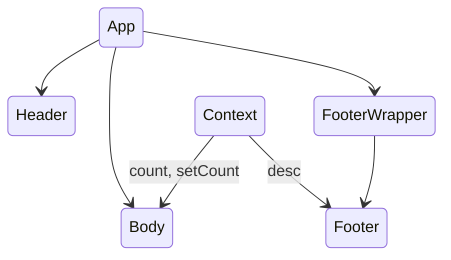

## re-render

### Context

当 Context 变化时：

- 未订阅当前 Context 的组件，不会触发 re-render
- 若 context 为 Object, 除了变化的属性，订阅其他属性的组件，也会触发 re-render

考虑如下 Context，以及组件形式：

- Context 包含 count, setCount, desc(不会变化的 string)
- Body 订阅 count, setCount
- Footer 订阅 desc
- Body 出发 setCount 时，Body 和 Footer 会 re-render。其他组件，均不会 re-render。

```typescript
import { FC, ReactNode, createContext, useState } from 'react';

const DESC = 'Click on the Vite and React logos to learn more';

export const AppContext = createContext<{
  count: number;
  setCount: (_: number) => void;
  desc: string;
}>({
  count: 0,
  setCount: (count: number) => console.log(count),
  desc: DESC,
});

interface AppContextProviderProps {
  children?: ReactNode;
}

export const AppContextProvider: FC<AppContextProviderProps> = ({
  children,
}) => {
  const [count, setCount] = useState(0);

  return (
    <AppContext.Provider value={{ count, setCount, desc: DESC }}>
      {children}
    </AppContext.Provider>
  );
};
```



### Zustand

Zustand 提供了原子形式选择，来避免 state 中某个值变化，引起订阅了其他值的组件 re-render。

```typescript
// useBearStore.ts
import { create } from 'zustand';
import { combine } from 'zustand/middleware';

const useBearStore = create(
  combine(
    { count: 0, desc: 'Click on the Vite and React logos to learn more' },
    set => ({
      addCount: () => set(state => ({ count: state.count + 1 })),
    }),
  ),
);

export default useBearStore;

// Body.tsx
const count = useBearStore(state => state.count);
const addCount = useBearStore(state => state.addCount);

// Footer.tsx
// addCount 时，不会 re-render
const desc = useBearStore(state => state.desc);
// addCount 时，会 re-render
const state = useBearStore();
```
