## Ref
* [官网](https://mermaid-js.github.io/mermaid/#/)  
* [live editor](https://mermaid-js.github.io/mermaid-live-editor/)

## 流程图

### 节点
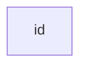

### 包含文本的节点
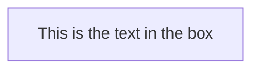

### 图
* 从上到下 `TDTB`
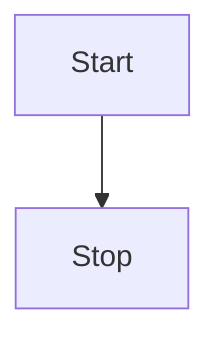
* 从左到右 `LR`
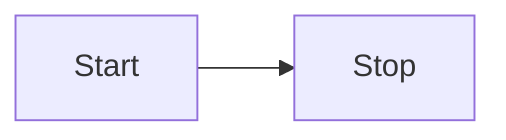

全部方向：
  - TB - 从上到下
  - TD - 自上而下/从上到下相同
  - BT - 从下到上
  - RL - 从右到左
  - LR - 从左到右

### 节点形状
* 圆边 `id1(This is the text in the box)`
* 运动场形状 `id1([This is the text in the box])`
* 子例程 `id1[[This is the text in the box]]`
* 圆柱形 `id1[(Database)]`
* 圆形 `id1((This is the text in the circle))`
* 菱形 `id1{This is the text in the box}`
* 六边形 `id1{{test}}`
* 平行四边形 `id1[/feishu/]`, `id1[\feishu\]`
* 梯形 `A[/feishu\]`, `A[\feishu/]`

### 节点间的连接
* 带箭头的连接 `A-->B`
* 开放式连接 `A --- B`
* 带文字的连接 `A -- 文字 --- B`
* 带文字和箭头 `A-->|文字|B`
* 虚线 `A-.->B`
* 带文字虚线 `A-. 文字 .-> B`
* 加粗 `A ==> B`
* 带文字加粗 `A == 文字 ==> B`
* 连续 `A -- 文字 --> B -- 文字 --> C`
* 多个节点连接 `a --> b & c--> d`
* 依赖关系 `A & B--> C & D`

### 流程图示例
* 多个破折号,表示比其他线条长
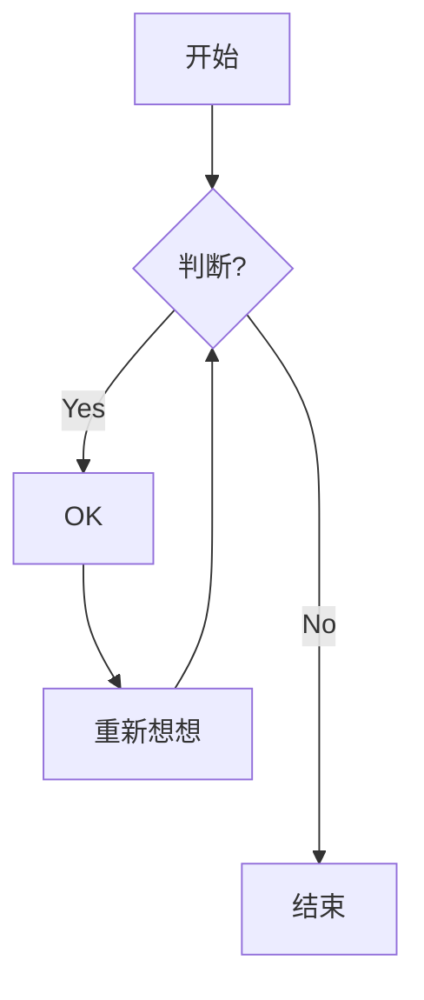

* 多子图
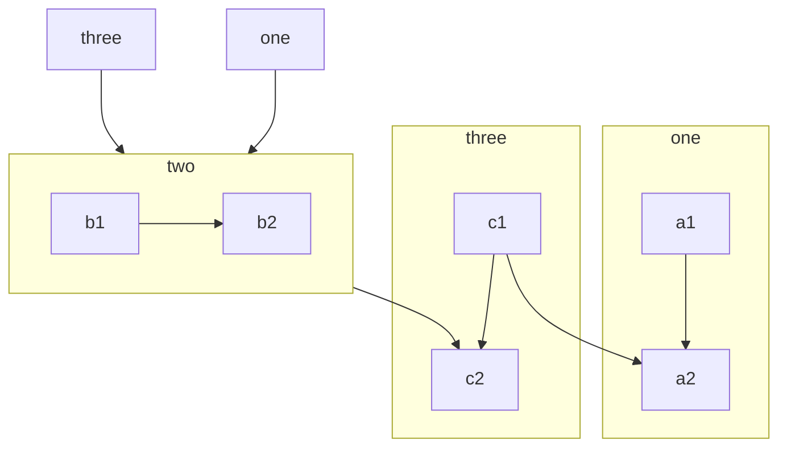

## 时序图
* 实线箭头 `->>`
* 虚线箭头 `-->>`
* 参与方 `participant Alice`
* 参与人 `actor Alice`
* 简写 `participant A as Alice`

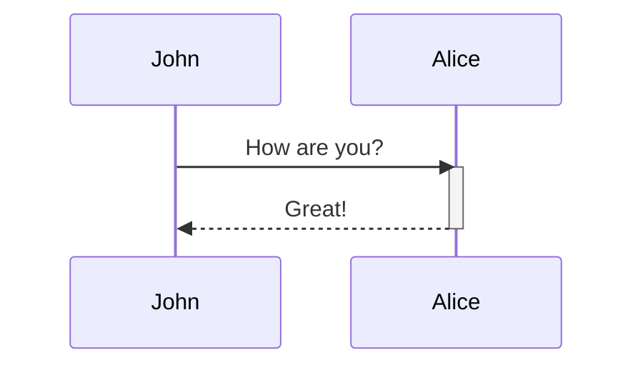

### 创建和销毁 (v10.3.0+)
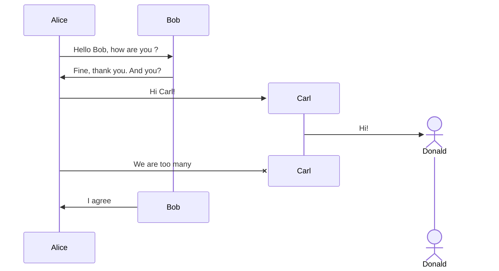

### Activations
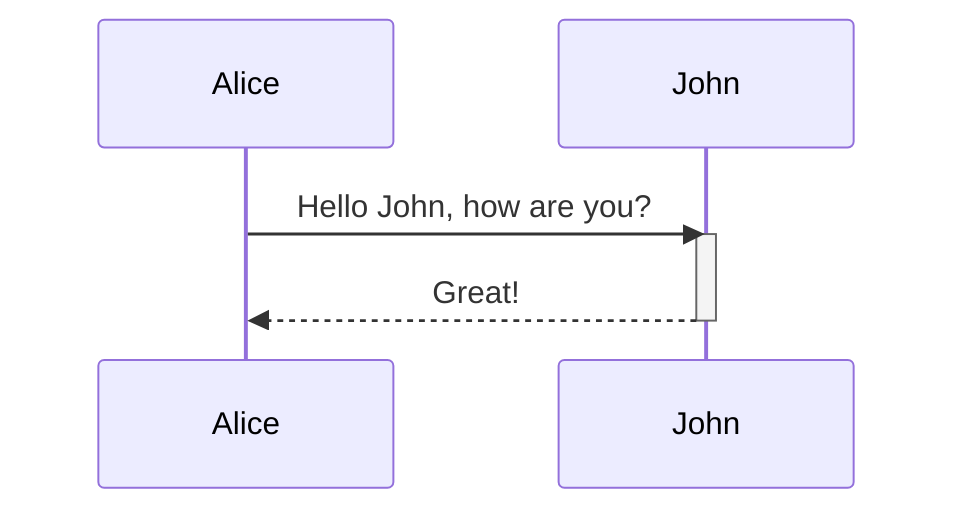
简写:
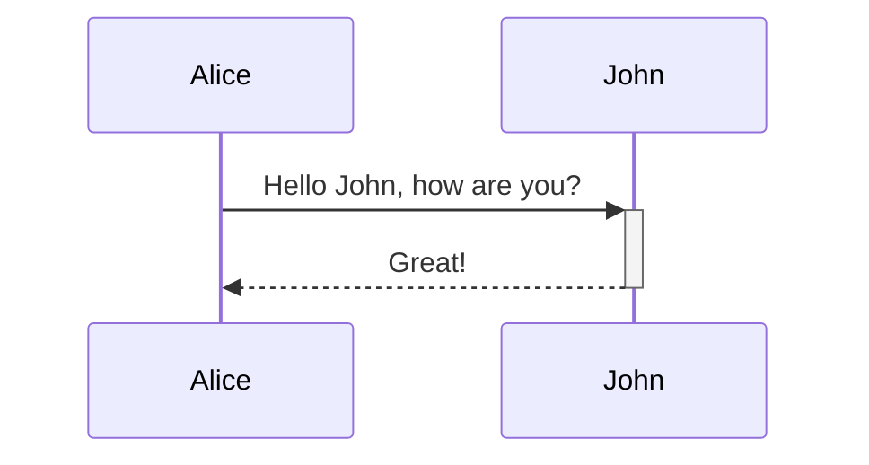

### Note
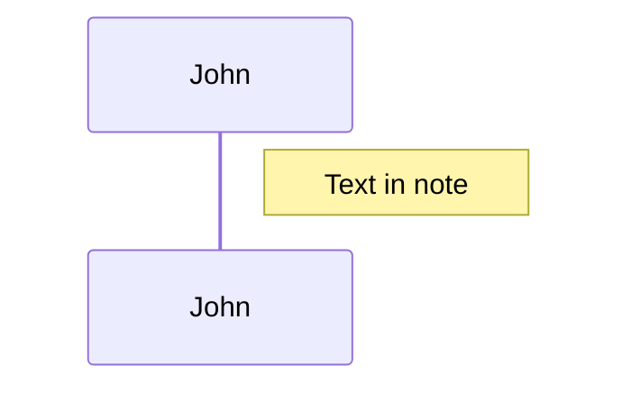
跨区
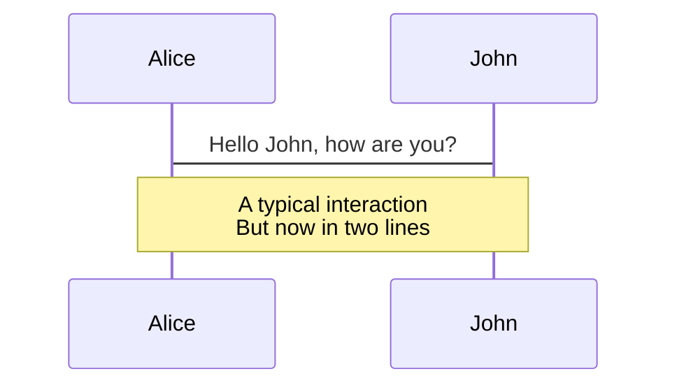

### 循环 Loops
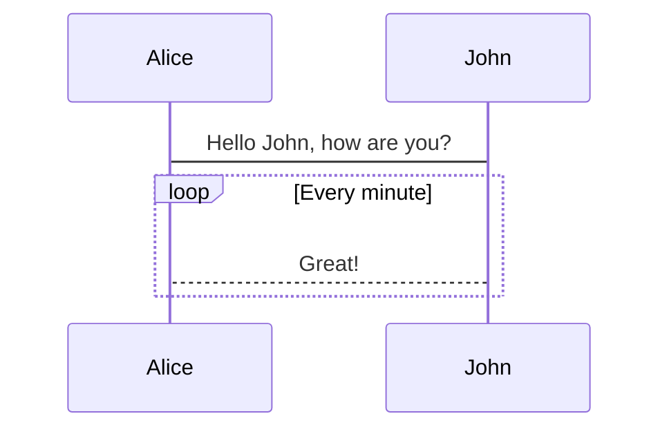

### 背景颜色
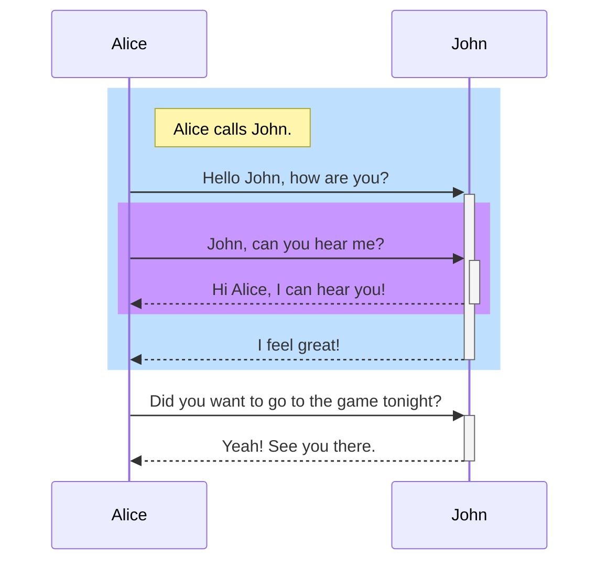
### 注释
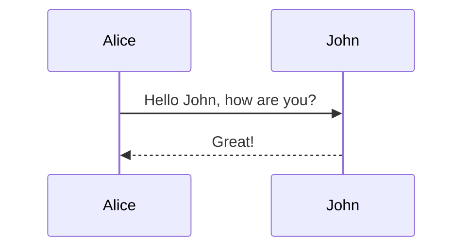

### 序号
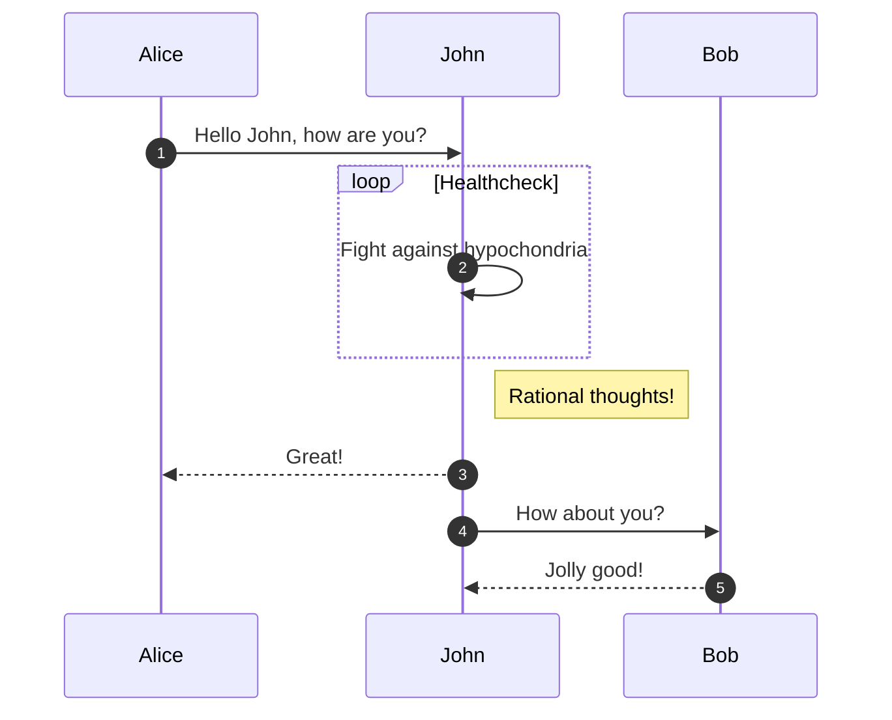

## UML
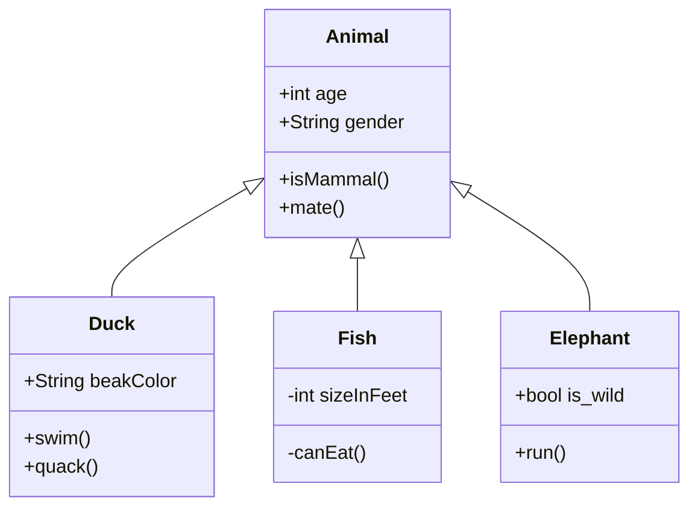
## 甘特图
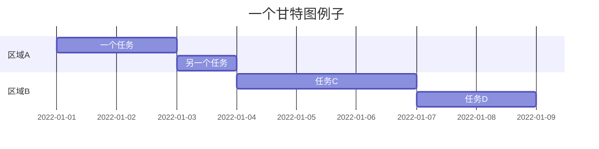
## 饼图
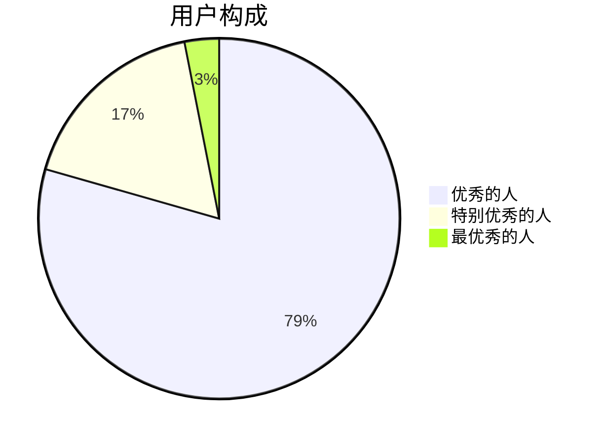
